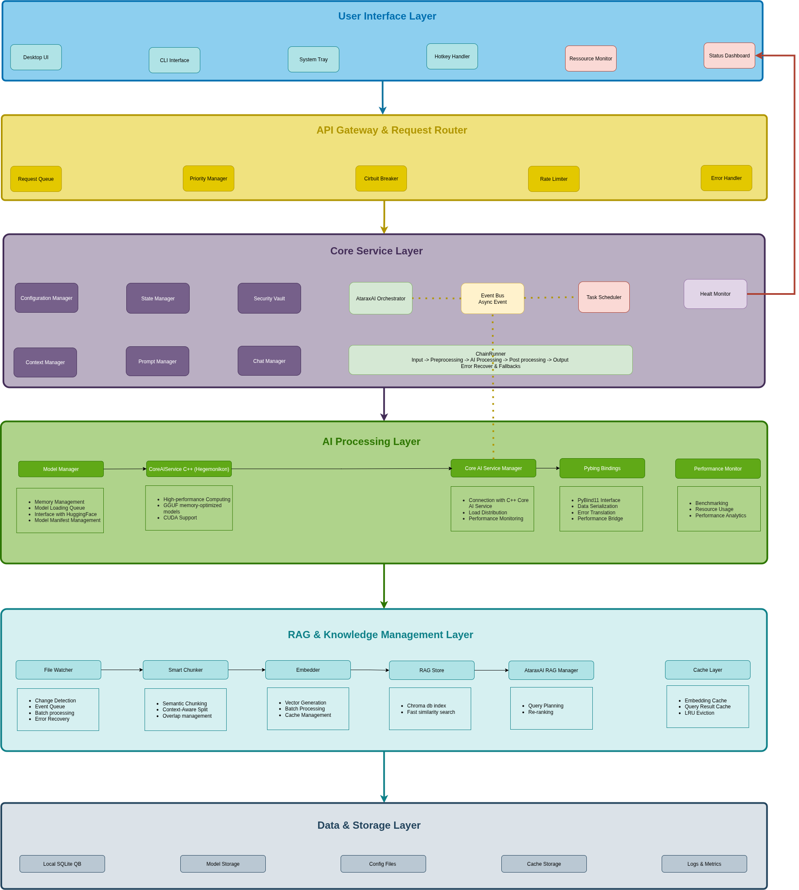

# Atarax-AI

<p align="center">
  <a href="https://github.com/zyannick/Atarax-AI/actions/workflows/ci.yml"></a>
  <a href="https://coveralls.io/github/zyannick/Atarax-AI?branch=main"></a>
  <a href="https://github.com/zyannick/Atarax-AI/releases"></a>
  
  <a href="https://img.shields.io/badge/platform-Linux%20%7C%20macOS%20%7C%20Windows-lightgrey.svg"></a>
</p>

<p align="center">
  
  
  
  
  <br>
  
  
  
  
  
</p>

## Un Asistente de IA Local y que Preserva la Privacidad, Impulsado por llama.cpp

**Totalmente sin conexión. Multi-modal. Seguro. Tuyo.**

Atarax-AI es un asistente de IA de uso completo que funciona completamente sin conexión utilizando llama.cpp, optimizado para inferencia de baja latencia y alta precisión en hardware de consumo. El asistente admite entradas multimodales (texto, voz, imágenes y videos), realiza razonamiento en tiempo real y se integra con APIs del sistema local (todo sin ninguna dependencia de la nube).


## Descripción General de la Arquitectura

> **Nota**: Actualmente estamos refactorizando el backend antes de integrar el frontend.



## Visión del Proyecto

Crear un asistente de IA listo para producción que:
- **100% Funcionamiento sin Conexión** - No se requiere conexión a internet después de la configuración
- **Diseño Centrado en la Privacidad** - Todo el procesamiento de datos se realiza localmente
- **Optimizado para Hardware de Consumo** - Funciona eficientemente en portátiles y escritorios
- **Interacción Multimodal** - Capacidades de procesamiento de texto, voz y documentos
- **Integración Fluida** - Funciona con tu flujo de trabajo y aplicaciones existentes

## Características Clave

### Capacidades Principales
- **Asistente de Texto Inteligente** - Respuestas conscientes del contexto con razonamiento avanzado
- **Interacción por Voz** - Integración con Whisper.cpp para procesamiento natural del habla
- **Procesamiento de Documentos** - Análisis de archivos local y creación de base de conocimientos
- **Memoria Persistente** - Búsqueda semántica con retención de contexto a largo plazo
- **Integración con el Sistema** - Calendario, gestión de archivos y automatización de tareas

### Excelencia Técnica
- **Gestión Adaptativa del Contexto** - Técnicas de ventana deslizante para un rendimiento óptimo
- **Arquitectura Modular** - Framework flexible de ingeniería de prompts
- **Monitoreo en Tiempo Real** - Optimización del rendimiento y registro completo
- **Soporte Multiplataforma** - Compatibilidad con Linux, macOS y Windows

### Seguridad y Privacidad
- **Gestión Local de Claves** - Claves derivadas de contraseña, nunca almacenadas en disco
- **Eliminación Segura de Datos** - Borrado criptográfico de información sensible
- **Cero Telemetría** - Sin recopilación de datos ni transmisiones externas

## Inicio Rápido

Pronto proporcionaremos paquetes para Linux/Windows/Mac. Por ahora, puedes compilar el docker localmente. Opcionalmente puedes descargarlo de docker hub (https://hub.docker.com/repositories/ataraxai).

### Requisitos Previos
- Docker y Docker Compose
- NVIDIA GPU (opcional, para aceleración GPU)
- 8GB+ de RAM recomendados

### Opción 1: Docker (Recomendado)

#### Descargar desde Docker Hub
```bash
# Para la versión CPU
docker pull ataraxai/ataraxai:latest
docker run -it --rm -p 8000:8000 ataraxai/ataraxai:latest
```

#### Versión CPU localmente
```bash
# Construir la imagen
docker build -t ataraxai:cpu -f docker/Dockerfile.cpu .

# Ejecutar el contenedor
docker run -it --rm -p 8000:8000 ataraxai:cpu
```

#### Versión GPU localmente
```bash
# Construir la imagen
docker build -t ataraxai:gpu -f docker/Dockerfile.gpu .

# Ejecutar con soporte GPU
docker run --gpus all -it --rm -p 8000:8000 ataraxai:gpu
```

### Opción 2: Instalación Local
```bash
# Ejecutar el script de instalación
./install.sh

# Opciones disponibles:
# --use-uv          Esto creará un .venv para usar el entorno uv (Necesitas tener uv instalado en tu sistema operativo) 
# --use-conda       Usar entorno conda
# --clean           Limpiar construcciones anteriores
# --clean-ccache    Limpiar caché de compilación C++
# --use-cuda        Compilar con soporte CUDA
# --only-cpp        Compilar solo componentes C++
# --cuda-arch       Especificar arquitectura CUDA

# Iniciar el servidor API
uvicorn api:app --reload --host 0.0.0.0 --port 8000
```

## Monitoreo y Observabilidad

Lanza el stack de monitoreo para rastrear el rendimiento y el uso de recursos:

### Monitoreo Completo (CPU + GPU)
```bash
docker compose -f docker-compose.monitoring.base.yml -f docker-compose.monitoring.gpu.yml up -d
```

### Monitoreo Solo CPU
```bash
docker compose -f docker/docker-compose.monitoring.base.yml up -d
```

### Acceder a los Servicios de Monitoreo
- **Backend FastAPI**: http://localhost:8000
- **Métricas de Prometheus**: http://localhost:9090
- **Node Exporter**: http://localhost:9100
- **Panel de Grafana**: http://localhost:3000

## Documentación

### Referencia de la API
Accede a la documentación interactiva de la API en http://localhost:8000/docs una vez que el servidor esté en ejecución.

## Compromiso con la Privacidad

Atarax-AI está diseñado con la privacidad como principio fundamental:

- **Sin Dependencia de la Nube** - Todo funciona en tu hardware
- **Sin Llamadas a APIs Externas** - Cero solicitudes de red a servicios de terceros  
- **Almacenamiento Local de Datos** - Todos los datos cifrados y almacenados localmente
- **Transparencia de Código Abierto** - Inspección y auditoría completa del código fuente
- **Control del Usuario** - Propiedad completa de tus datos e interacciones

## Contribuir

¡Damos la bienvenida a las contribuciones! Por favor consulta nuestras [Guías de Contribución](CONTRIBUTING.md) para obtener detalles sobre:
- Estilo y estándares de código
- Requisitos de pruebas
- Proceso de solicitudes de extracción (pull requests)
- Reporte de problemas

## Hoja de Ruta

- [ ] Aplicación de escritorio con frontend Tauri
- [ ] Optimización
- [ ] Soporte para aplicaciones móviles
- [ ] Sistema de complementos para integraciones personalizadas
- [ ] Comprensión avanzada de documentos
- [ ] Soporte multilingüe
- [ ] Capacidades de síntesis de voz

## Licencia

Este proyecto está licenciado bajo la [Licencia GNU GPLv3](LICENSE). Eres libre de usar, modificar y distribuir este software bajo los términos de la GPL.

## Reconocimientos

Construido con estos increíbles proyectos de código abierto:
- [llama.cpp](https://github.com/ggerganov/llama.cpp) - Inferencia de LLM de alto rendimiento
- [Whisper.cpp](https://github.com/ggerganov/whisper.cpp) - Reconocimiento de voz
- [FastAPI](https://fastapi.tiangolo.com/) - Framework web moderno de Python
- [Tauri](https://tauri.app/) - Aplicaciones de escritorio multiplataforma

---

<p align="center">
  <strong>Hecho con ❤️ para usuarios conscientes de la privacidad que valoran la IA local</strong>
</p>
