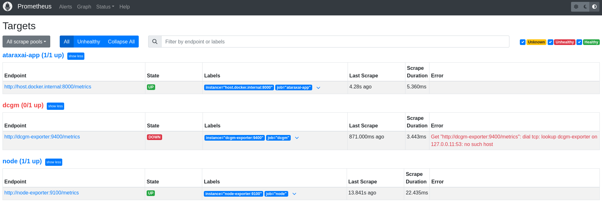

# Atarax-AI

A Local, Privacy-Preserving AI Assistant Powered by llama.cpp

_Fully offline. Multi-modal. Secure. Yours._

Develop a full-featured AI assistant that runs entirely offline using llama.cpp, optimized for low-latency, high-accuracy inference on consumer-grade hardware (laptop, smartphone)

The assistant supports multi-modal inputs (text + voice + images/videos), performs real-time reasoning, and integrates with local system APIs (calendar, file system, etc.)  all with zero cloud dependency.


## Key Features

- Quantized Model Deployment: Use 4-bit or 5-bit quantization with llama.cpp to make large models run smoothly on CPU or edge devices.
- Custom Prompt Engineering Engine: Create a modular prompting system (like reusable “prompt chains”) to allow dynamic behaviors (e.g., “summarize recent emails,” “generate shell scripts,” “answer from local docs”).
- Voice Interface: Integrate Whisper.cpp for speech-to-text, making it a voice-capable offline assistant.
- Local Contextual Memory: Maintain persistent local memory (e.g., SQLite + embeddings) for personal assistant functionality.
- Privacy-First Design: No cloud calls; all processing and data storage is local. Emphasize encryption, transparency, and control.
- Smart Caching and Context Window Management: Implement sliding-window techniques, smart summarization, and embeddings to keep long-term context in RAM-limited environments.


## Planning
  - [x] Core Setup with llama.cpp. whisper.cpp
  - [x] Automatic local benchmarking
  - [ ] Frompt engineering framework
  - [ ] Embedding Store + Context Management
  - [ ] System Integration
  - [ ] UI Layer
  - [ ] Testing, Benchmarking, Optimization 


## Usage 

### Local installation

You can install ataraxai using the command line for cpu installation:

```
./install.sh  --clean
```

and for gpu installation :

```
./install.sh --clean --use-cuda  
```

### Docker installation

We have provide two versions:

  - CPU: 
  ``` 
    docker build -t ataraxai:cpu -f docker/Dockerfile.cpu .

    docker run -it --rm -v "$(pwd)/data:/app/data:ro"  ataraxai:cpu
  ```

  - GPU:
  ``` 
    docker build -t ataraxai:gpu -f Dockerfile.gpu .

    docker run --gpus all -it --rm ataraxai:gpu
  ``` 

### Monitoring using Grafana/Prometheus

We also provide some script to monitor your application. In a first terminal, you can launch:

- for CPU and GPU monitoring:
``` 
docker compose -f docker-compose.monitoring.base.yml -f docker-compose.monitoring.gpu.yml up -d
``` 

- for only CPU monitoring:
``` 
docker compose -f docker/docker-compose.monitoring.base.yml up -d
``` 

In a second terminal:

- GPU:
``` 
docker run --gpus all -it --rm ataraxai:gpu
``` 


- CPU:
``` 
docker run -it --rm ataraxai:cpu
``` 

Then you can monitor in prometheus/grafana:



## Modules

### Core Infra

We try to setup a module to automatically benchmark the models on the user laptop and them select the best model and the best quantization. 

- Set up llama.cpp locally (CPU + GPU support)
- Test quantized model (e.g. 7B Q4_K_M)
- Script inference loop with logging
- Benchmark token throughput

### Prompt & Task Engine

This module is to setup the Prompt Engineering Framework:

- Create modular prompt system
- Design reusable templates and task runners

### Embedding Store + Context Management 

We will also try to setup a module for embedding storage and context management:

- Integrate ChromaDB
- Add semantic search, chunking strategies
- Implement context window manager


### System integration

In this module we will try to integrate information from the system:

- File system, calendar, notes, task access via APIs
- OS-level hooks or CLI integrations

## Privacy Policy

- No cloud dependency
- No external API calls
- All data stored locally in encrypted formats
- Source code and logs are fully inspectable by user


## License

This project is licensed under the [GNU GPLv3 License](LICENSE).  
You are free to use, modify, and distribute this software under the terms of the GPL.

### 🚫 No Commercial Use Without Compliance

If you use this in a commercial or derivative system, **your entire codebase must also be licensed under GPLv3**.

If you want a commercial license or integration support, please contact: yannickzoet@gmail.com.
