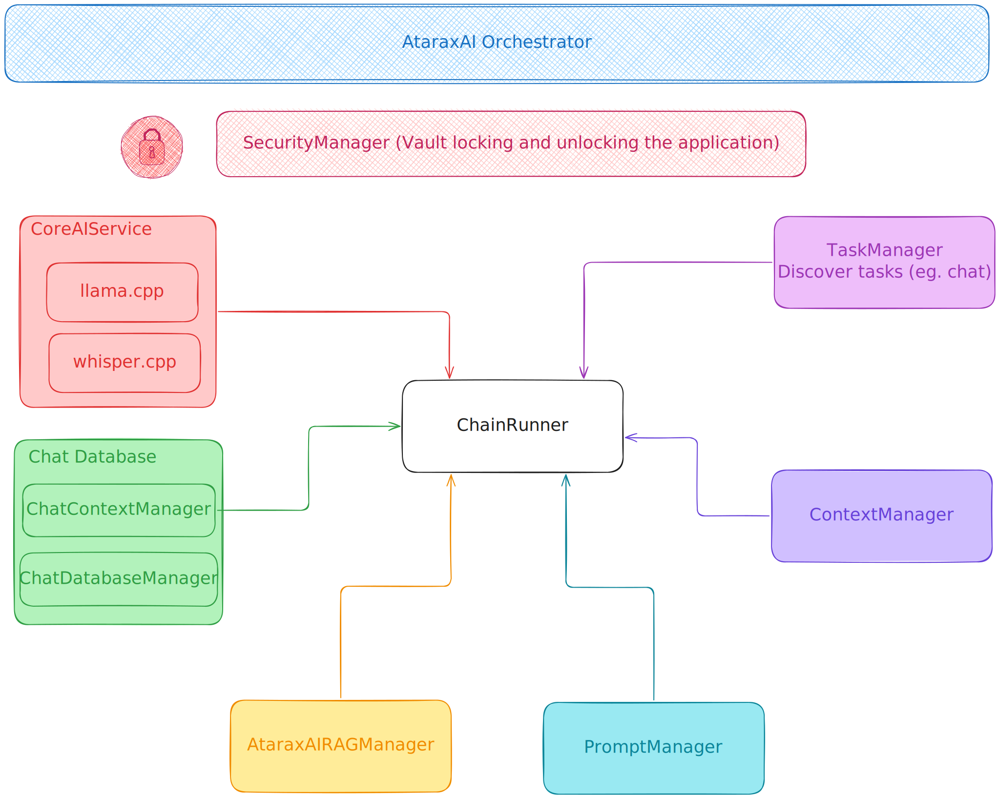

<!--  -->

# Atarax-AI

A Local, Privacy-Preserving AI Assistant Powered by llama.cpp

_Fully offline. Multi-modal. Secure. Yours._

Developing a full-featured AI assistant that runs entirely offline using llama.cpp, optimized for low-latency, high-accuracy inference on consumer-grade hardware (laptop, smartphone)

The assistant supports multi-modal inputs (text + voice + images/videos), performs real-time reasoning, and integrates with local system APIs (calendar, file system, etc.)  all with zero cloud dependency.

## 🎯 Project Vision

Create a production-ready AI assistant that:
- Runs 100% offline - No internet connection required after setup
- Preserves privacy - All data processing happens locally
- Works on consumer hardware - Optimized for laptops and desktop computers
- Provides multi-modal interaction - Text, voice, and document processing
- Integrates with your workflow - Seamless integration with local applications

## ✨ Features

### Core Capabilities
- Text-based AI assistant with context-aware responses
- Voice interaction via Whisper.cpp integration
- Document processing for local files and knowledge bases
- Persistent memory with semantic search capabilities
- System integration for calendar, files, and task management

### Technical Highlights
- Adaptive context management with sliding window techniques
- Modular prompt engineering framework
- Real-time performance monitoring and optimization
- Comprehensive logging and debugging tools

### Security Features
- End-to-end encryption - All user data encrypted with AES-256-GCM
- Local key management - Keys derived from user password, never stored
- Secure deletion - Cryptographic erasure of sensitive data
<!-- - **Memory protection** - Sensitive data cleared from RAM after use
- **Audit logging** - All security events logged and encrypted -->

## Privacy Policy

- No cloud dependency
- No external API calls
- All data stored locally in encrypted formats
- Source code and logs are fully inspectable by user

## License

This project is licensed under the [GNU GPLv3 License](LICENSE).  
You are free to use, modify, and distribute this software under the terms of the GPL.

