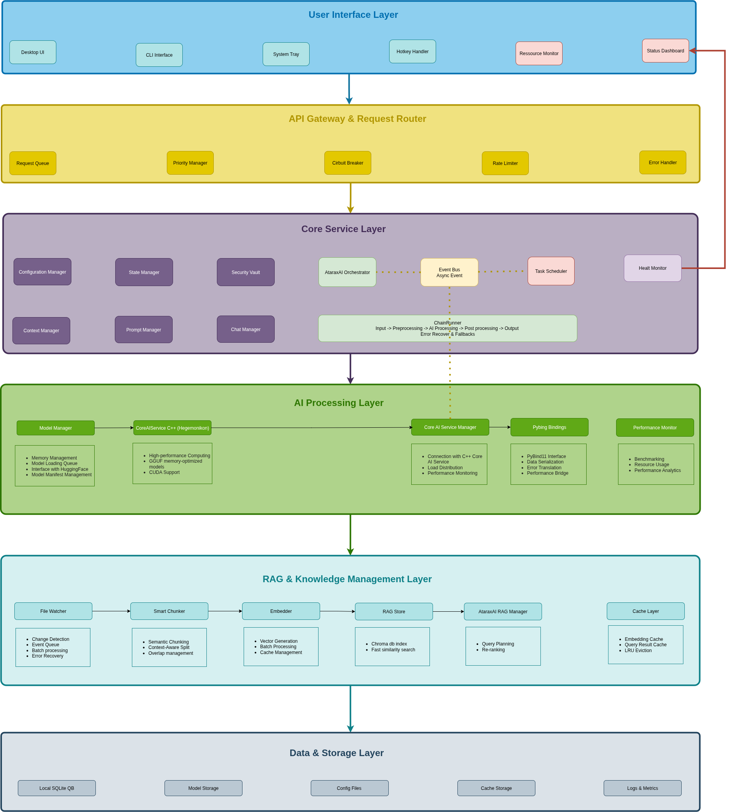

# Atarax-AI

<p align="center">
  <a href="https://github.com/zyannick/Atarax-AI/actions/workflows/ci.yml"></a>
  <a href="https://coveralls.io/github/zyannick/Atarax-AI?branch=main"></a>
  <a href="https://github.com/zyannick/Atarax-AI/releases"></a>
  
  <a href="https://img.shields.io/badge/platform-Linux%20%7C%20macOS%20%7C%20Windows-lightgrey.svg"></a>
</p>

<p align="center">
  
  
  
  
  <br>
  
  
  
  
  
</p>

## A Local, Privacy-Preserving AI Assistant Powered by llama.cpp

**Fully offline. Multi-modal. Secure. Yours.**

Atarax-AI is a full-featured AI assistant that runs entirely offline using llama.cpp, optimized for low-latency, high-accuracy inference on consumer-grade hardware. The assistant supports multi-modal inputs (text, voice, images, and videos), performs real-time reasoning, and integrates with local system APIs (all with zero cloud dependency).


## Architecture Overview

> **Note**: We are currently refactoring the backend before integrating the front-end.



## 🎯 Project Vision

Create a production-ready AI assistant that:
- **100% Offline Operation** - No internet connection required after setup
- **Privacy-First Design** - All data processing happens locally
- **Consumer Hardware Optimized** - Runs efficiently on laptops and desktops
- **Multi-Modal Interaction** - Text, voice, and document processing capabilities
- **Seamless Integration** - Works with your existing workflow and applications

## ✨ Key Features

### 🧠 Core Capabilities
- **Intelligent Text Assistant** - Context-aware responses with advanced reasoning
- **Voice Interaction** - Whisper.cpp integration for natural speech processing
- **Document Processing** - Local file analysis and knowledge base creation
- **Persistent Memory** - Semantic search with long-term context retention
- **System Integration** - Calendar, file management, and task automation

### ⚡ Technical Excellence
- **Adaptive Context Management** - Sliding window techniques for optimal performance
- **Modular Architecture** - Flexible prompt engineering framework
- **Real-Time Monitoring** - Performance optimization and comprehensive logging
- **Cross-Platform Support** - Linux, macOS, and Windows compatibility

### 🔒 Security & Privacy
- **Local Key Management** - Password-derived keys, never stored on disk
- **Secure Data Deletion** - Cryptographic erasure of sensitive information
- **Zero Telemetry** - No data collection or external transmissions

## 🚀 Quick Start

We will provide soon packages for Linux/Windows/Mac. For now, you can build the docker locally. Optionnaly you can pull it from docker hub (https://hub.docker.com/repositories/ataraxai).

### Prerequisites
- Docker and Docker Compose
- NVIDIA GPU (optional, for GPU acceleration)
- 8GB+ RAM recommended

### Option 1: Docker (Recommended)

#### Pull from Docker Hub
```bash
# For the CPU version
docker pull ataraxai/ataraxai:latest
docker run -it --rm -p 8000:8000 ataraxai/ataraxai:latest
```

#### CPU Version locally
```bash
# Build the image
docker build -t ataraxai:cpu -f docker/Dockerfile.cpu .

# Run the container
docker run -it --rm -p 8000:8000 ataraxai:cpu
```

#### GPU Version locally
```bash
# Build the image
docker build -t ataraxai:gpu -f docker/Dockerfile.gpu .

# Run with GPU support
docker run --gpus all -it --rm -p 8000:8000 ataraxai:gpu
```

### Option 2: Local Installation
```bash
# Run the installation script
./install.sh

# Available options:
# --use-uv          This will create a .venv to use uv env (You need to have uv install in your OS) 
# --use-conda       Use conda environment
# --clean           Clean previous builds
# --clean-ccache    Clean C++ compilation cache
# --use-cuda        Build with CUDA support
# --only-cpp        Build only C++ components
# --cuda-arch       Specify CUDA architecture

# Start the API server
uvicorn api:app --reload --host 0.0.0.0 --port 8000
```

## 📊 Monitoring & Observability

Launch the monitoring stack to track performance and resource usage:

### Full Monitoring (CPU + GPU)
```bash
docker compose -f docker-compose.monitoring.base.yml -f docker-compose.monitoring.gpu.yml up -d
```

### CPU-Only Monitoring
```bash
docker compose -f docker/docker-compose.monitoring.base.yml up -d
```

### Access Monitoring Services
- **FastAPI Backend**: http://localhost:8000
- **Prometheus Metrics**: http://localhost:9090
- **Node Exporter**: http://localhost:9100
- **Grafana Dashboard**: http://localhost:3000

## 📚 Documentation

### API Reference
Access the interactive API documentation at http://localhost:8000/docs once the server is running.

## 🛡️ Privacy Commitment

Atarax-AI is designed with privacy as a fundamental principle:

- **No Cloud Dependency** - Everything runs on your hardware
- **No External API Calls** - Zero network requests to third-party services  
- **Local Data Storage** - All data encrypted and stored locally
- **Open Source Transparency** - Full source code inspection and auditing
- **User Control** - Complete ownership of your data and interactions

## 🤝 Contributing

We welcome contributions! Please see our [Contributing Guidelines](CONTRIBUTING.md) for details on:
- Code style and standards
- Testing requirements
- Pull request process
- Issue reporting

## 📋 Roadmap

- [ ] Desktop application with Tauri frontend
- [ ] Mobile application support
- [ ] Plugin system for custom integrations
- [ ] Advanced document understanding
- [ ] Multi-language support
- [ ] Voice synthesis capabilities

## ⚖️ License

This project is licensed under the [GNU GPLv3 License](LICENSE). You are free to use, modify, and distribute this software under the terms of the GPL.

## 🙏 Acknowledgments

Built with these amazing open-source projects:
- [llama.cpp](https://github.com/ggerganov/llama.cpp) - High-performance LLM inference
- [Whisper.cpp](https://github.com/ggerganov/whisper.cpp) - Speech recognition
- [FastAPI](https://fastapi.tiangolo.com/) - Modern Python web framework
- [Tauri](https://tauri.app/) - Cross-platform desktop applications

---

<p align="center">
  <strong>Made with ❤️ for privacy-conscious users who value local AI</strong>
</p>
